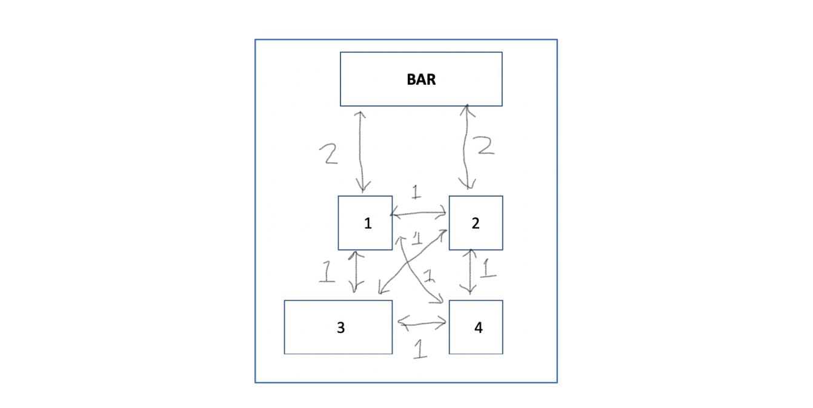

# PDDL 2.1 Model Explanation:

The domain was modeled with Temporal Planning because of its relative ease of representing the model. In this case actions defined to represent the problem are classified into two groups, **durative-actions** _(actions that have a duration)_ and **instantaneous actions.**

### Durative Actions

1. Prepare-drinks
1. Move
1. Clean-table

### Instantaneous actions

1. Pick-up-drink
1. Load-tray
1. Load-last-tray
1. Pick-up-tray
1. Drop-drink
1. Drop-tray-drink
1. Drop-tray

## Drink Preparation

The preparation of the drinks is handled by a single durative-action; prepare-drink. This action is autonomous from the rest of the actions in the model, it is initiated by the predicate **_(drink-order ?table ?drink)_**. If a drink is ordered by a customer the barista robot prepares the drink ordered. Each drink has its duration for the preparation which depends on the type of drink it is (cold or warm). If it’s cold the preparation duration is 3 time unit and if it is warm the preparation duration is 5 time unit. The duration of the drink is initialized in the problem file with the function **_(prep-time ?drink)_**. The preparation of a drink has to be over before the preparation of another drink is started, the boolean predicate **_(preparing)_** helps to make this happen. The barista robot sets the predicate **_(preparing)_** to true after starting the drink preparation which makes it impossible to start the preparation of another drink. And when the preparation is done the barista robot drops the drink at the bar and increases the value of drinks that are ready.

```lisp
 (:durative-action prepare-drink
        :parameters (?drink - drink ?table - table ?bar - bar)
        :duration (= ?duration (prep-time ?drink))
        :condition (and
            (at start (drink-order ?table ?drink))
            (at start (not (preparing))) ; another drink is not already preparing 
        )
        :effect (and
            (at start (preparing))
            (at end (not (preparing)))
            (at end (drink-at ?drink ?bar))
            (at end (increase (drink-ready) 1))
        )
   )
```

## Waiter Movement

The modeling of the movement is inspired by an rover movement example I found on a [GitHub page](https://github.com/yarox/pddl-examples.git). **_(conn-length ?from ?to)_** represents the distance between the location from and to, this distance is then used to calculate the time it'll take the waiter robot to move that distance by dividing the distance by the speed (**2 meter / time unit when using the tray, 1 meter / time unit when not using the tray**) of the robot. The robot can only be in one of two types of location, the bar and a table. This is why a bar and table was defined as a subtype of location so the waiter robot can move freely between the bar and the table. The **_(conn ?from ?to)_** predicate is another important predicate that is true if there's a connection between the from and to location. It helps to describe the layout of the restaurant; showing the path of motion that can be taken by the waiter robot. The connection is a one to one connection i.e **(conn bar table1)** and **(conn table1 bar)** meaning the bar is connected to table1 and table1 is connected to the bar. When initializing the connections in the problem file the layout of the restaurant was taken into account, for example; the bar is only connected to the table 1 and table 2, it is not connected to table3 or table4.



```lisp
(:durative-action move
        :parameters (?from ?to - location)
        :duration (= ?duration (/ (conn-length ?from ?to) (speed)))
        :condition (and
            (at start (at-robby ?from))
            (over all (conn ?from ?to)) ; this predicate has to be true for the duration of the action 
        )
        :effect (and
            (at start (not (at-robby ?from)))
            (at end (at-robby ?to))
            (at end (not (at-robby ?from)))
        )
    )
```

## Delivering Drinks

To deliver a drink to a customer three basic actions has to take place, the waiter robot has to pick up the drink from the bar move to the table where the customer that order the drink is sitted at and drop the drink on that table. To model this actions a number of instantaneous actions were used.

- Pick-up-drink
- Load-tray
- Load-last-tray
- Pick-up-tray
- Drop-drink
- Drop-tray-drink
- Drop-tray

**pick-up-drink**

This action is activated when the number of drinks that are ready is exactly one. For this action the waiter robot picks up the drink with its gripper and set the gripper to not empty, which causes the gripper to be able to pick only one drink at a time. The planning engine used for this domain is LPG, since LPG does not allow equality sign in the procondition, the precondition was modelled in such a way that the precondtion is true when the drinks ready is greater than 0 and less than 2 (which is only true when the drink ready is equal to 1). The precondition **_(not (loading-tray))_** was set because of the use of tray. In the case when the robot is loading the tray with drinks and then reducing the number of drinks that are ready, the **_(loading-tray)_** predicate is set so the waiter robot does'nt pick up a drink while the robot is loading the tray and the drink ready equals 1.

```lisp

    (:action pick-up-drink
        :parameters (?drink - drink ?bar - bar)
        :precondition (and (at-robby ?bar) (drink-at ?drink ?bar) (gripper-free) (> (drink-ready) 0) (< (drink-ready) 2) (not (loading-tray))
            (not (carrying ?drink)) (tray-at-bar) (< (on-tray) 1) (not (carrying-tray))
        )
        :effect (and (not (drink-at ?drink ?bar)) (assign (speed) 2) (not (gripper-free)) (carrying ?drink) (decrease (drink-ready) 1))
    )
```

**load-tray**

The load tray action is activated when the drinks that are ready are greater than 1. The drinks are carried one after the other and the number of drinks on tray is increased, this is signified by **_(carrying ?drink)_** and **_(increase (on-tray) 1)_**. The tray can carry a maximum of 3 drinks so the predicate **_(< (on-tray) 3)_** is set as a precondition.

```lisp
 (:action load-tray
        :parameters (?drink - drink ?bar - bar)
        :precondition (and (at-robby ?bar) (drink-at ?drink ?bar) (gripper-free)
            (> (drink-ready) 1)
            (not (carrying ?drink)) (< (on-tray) 3) (tray-at-bar) (not (carrying-tray))
        )
        :effect (and (carrying ?drink) (not (drink-at ?drink ?bar)) (increase (on-tray) 1) (decrease (drink-ready) 1) (loading-tray)
            (gripper-free)
        )
)
```

**load-last-drink**

The precondition for **load-tray** action is drink ready is greater than 1, with an effect of decreasing the value of drink ready by one. Since the precondition of **load-tray** action is drink ready greater than 1 and the action sets the loading drink predicate to true, when the drinks ready becomes one and the loading drink predicate is true, the precondition for both **pick-up-drink** and **load-tray** action is false. This means we need an action to pick up the last drink when loading the tray with drinks, this is where load last drink comes in. The **load-last-drink** action is activated when the number of drinks ready is greater than 0 and loading-tray is true. For the waiter robot to pick up a tray with drinks the predicate **_(tray-ready)_** has to be true. The load last drink action set the (tray-ready) predicate to true in its effect. This forces the planner to always default to this action to pick up the last drink for a tray.

```lisp
(:action load-last-drink
        :parameters (?drink - drink ?bar - bar)
        :precondition (and (at-robby ?bar) (drink-at ?drink ?bar) (gripper-free)
            (> (drink-ready) 0) (loading-tray)
            (not (carrying ?drink)) (< (on-tray) 3) (tray-at-bar)
        )
        :effect (and (carrying ?drink) (not (drink-at ?drink ?bar)) (increase (on-tray) 1) (decrease (drink-ready) 1) (not (loading-tray))
            (tray-ready) (gripper-free)
        )
)
```

**pick-up-tray**

As describe earlier, the pickup up tray action is activated by (tray-ready) predicate. One important thing to note however is that in the effect of this action the speed of the robot is assign to 1 (slower speed)

**drop-drink**

To drop a drink, the waiter robot has to be at a table and the table has to correspond with the table that the customer that order the drink is sitting at. To model this senario, the following predicates are used _**(drink-order ?table ?drink), (at-robby ?table), (carrying ?drink)**_. (drink-order ?table ?drink) defines the table the drink was ordered from, (at-robby ?table) - defines the table the robot is at, (carrying ?drink) - defines the drink the robot is carrying. The effect of this is that the drink is at the table corresponding to the customer that order it, which means the drink has been delivered to the customer.

**drop-tray-drink**

The difference between the drop-drink and drop-tray-drink action is that the waiter robot is carrying tray and there is drink on that tray. The effect of the drop tray drink decreases the number of drinks on the tray.

```lisp
(:action drop-tray-drink
        :parameters (?drink - drink ?table - table)
        :precondition (and (carrying ?drink) (at-robby ?table) (drink-order ?table ?drink) (not (tray-at-bar))
            (carrying-tray) (> (on-tray) 0) (not (gripper-free))
        )
        :effect (and (drink-at ?drink ?table) (not (carrying ?drink))
            (decrease (on-tray) 1) (not (gripper-free))
        )
    )
```

**drop-tray**

For the waiter robot to clean a table the robot must not be carrying a tray and for the waiter robot to load tray the tray must be at the bar. All these is catter for by the action drop-tray, the effect of this is the tray is at the bar, the waiter robot is not carring the tray and the speed is assign 2 (faster speed).

```lisp
 (:action drop-tray
        :parameters (?bar - bar)
        :precondition (and (carrying-tray) (< (on-tray) 1) (at-robby ?bar) (not (gripper-free)))
        :effect (and (not (carrying-tray)) (tray-at-bar) (assign (speed) 2)
            (gripper-free))
)
```

## Cleaning Table
The cleaning table action is pretty straight forward; a table needs to be cleaned, the robot moves to that table,it takes sometime to clean it and then the table is clean. However, there are a number of preconditions that has to be true for this action to be activated. Before the action starts the tray has to be at the bar, the robot must not have started to load the tray with drinks and all through the duration of the action the robot has to be at the table that needs to be cleaned. It takes longer time to clean table3 because it is bigger, the (cleaning-time ?table) function is used to initialize the time it takes to clean each of the table from the problem file. 
```lisp
   (:durative-action clean-table
        :parameters (?table - table)
        :duration (= ?duration (cleaning-time ?table))
        :condition (and
            (at start (at-robby ?table)) ; at the table that needs cleaning 
            (at start (need-clean ?table))
            (at start (not (carrying-tray)))
            (at start (gripper-free))
            (at start (not (tray-ready))) ; no drinks on the tray 
            (at start (not (loading-tray)))
            (over all (at-robby ?table)) ; the robot has to always be at the dirty table all through the duration of the action 
        )
        :effect (and
            (at start (not (need-clean ?table)))
            (at end (not (need-clean ?table)))
            (at end (table-clean ?table))
        )
    )
```

# LPG Results 

